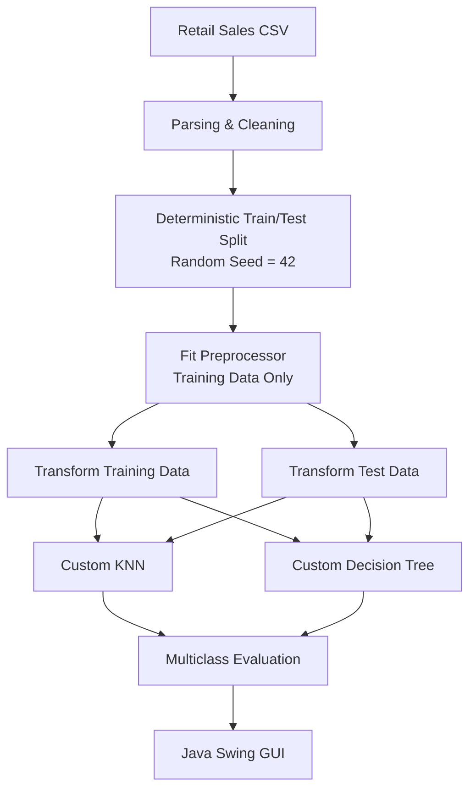
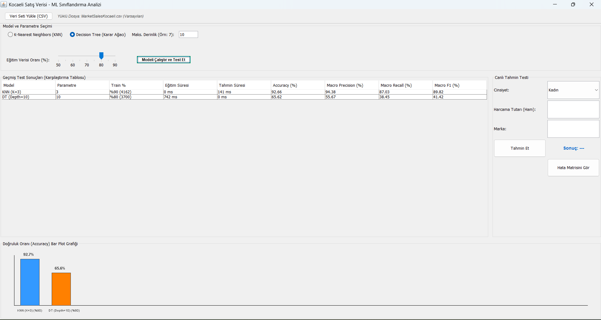

# 🧠 Retail Customer Classification in Java

A multiclass machine-learning application that implements **K-Nearest Neighbors (KNN)** and a **Decision Tree classifier from scratch in Java**, without using external machine-learning libraries.

The project was originally developed as a university coursework project and later refined to improve its machine-learning methodology, reproducibility and portfolio quality.

The application includes CSV ingestion, preprocessing, deterministic train/test splitting, custom classification algorithms, multiclass evaluation metrics, confusion matrices and an interactive Java Swing interface.

---

## 📌 Project Overview

The goal of the project is to predict the **product category** associated with a retail transaction using customer and transaction-related features.

The main features used by the models are:

- Gender
- Transaction net amount
- Brand

The target variable is:

- Product category

Two classification algorithms were implemented manually:

- **K-Nearest Neighbors (KNN)**
- **Decision Tree using Gini Impurity**

No external machine-learning framework such as Weka, scikit-learn or TensorFlow is used for the classifiers.

---

## ✨ Key Features

- Custom KNN implementation
- Custom Decision Tree implementation
- Multiclass classification
- CSV parsing and data cleaning
- Deterministic train/test split
- Train-only preprocessing
- Min-Max normalization
- Numerical and categorical feature handling
- Gini impurity calculation
- Recursive tree construction
- KNN majority voting
- Deterministic tie-breaking
- Accuracy evaluation
- Macro Precision
- Macro Recall
- Macro F1
- Confusion Matrix
- Training and inference time measurement
- Interactive Java Swing GUI
- Manual prediction interface
- Model comparison visualization

---

## 🏗️ Machine Learning Pipeline



---

## 🔐 Preventing Data Leakage

An important part of the preprocessing pipeline is that normalization parameters are learned **only from the training dataset**.

Incorrect approach:

```text
Entire Dataset
      ↓
Normalization
      ↓
Train/Test Split
```

This allows information from the future test set to influence preprocessing.

The project instead uses:

```text
Dataset
   ↓
Train/Test Split
   ↓
Training Data
   ↓
Learn Min / Max
   ↓
┌──────────────┬──────────────┐
│              │              │
▼              ▼              │
Train        Test             │
│              │              │
└──── Same training statistics
```

The test set therefore does not influence the parameters learned during preprocessing.

---

## 🔢 Numerical Feature Processing

The transaction amount is a numerical feature.

Min-Max normalization is applied using values learned from the training set:

```text
x_normalized = (x - train_min) / (train_max - train_min)
```

The same training-set minimum and maximum values are used for:

- Training records
- Test records
- Manual predictions from the GUI

---

## 🏷️ Categorical Feature Handling

Brand is treated as a **categorical feature**.

Earlier versions of the coursework encoded brands using arbitrary numbers such as:

```text
Brand A → 600
Brand B → 601
Brand C → 602
```

This creates artificial mathematical relationships between brands.

For example:

```text
distance(Brand A, Brand B) = 1
distance(Brand A, Brand C) = 2
```

There is no real semantic reason for such distances.

The refined implementation therefore preserves brand names as categorical values.

---

# 🔵 K-Nearest Neighbors

KNN was implemented manually in Java.

The algorithm:

1. Calculates the distance between the input sample and each training record.
2. Maintains the closest `K` neighbors using a `PriorityQueue`.
3. Performs majority voting over their target categories.
4. Uses distance-based deterministic tie-breaking when necessary.

---

## Mixed Feature Distance

The KNN distance function combines numerical and categorical information.

### Gender

```text
Same gender      → distance contribution = 0
Different gender → distance contribution = 1
```

### Transaction Amount

The normalized numerical difference is used:

```text
amount_difference =
normalized_amount_1 - normalized_amount_2
```

### Brand

```text
Same brand      → 0
Different brand → 1
```

The combined distance is calculated using a Euclidean-style formulation.

```text
distance =
sqrt(
    gender_difference²
    +
    amount_difference²
    +
    brand_mismatch²
)
```

This prevents arbitrary numeric brand IDs from affecting neighborhood calculations.

---

# 🟠 Decision Tree

The Decision Tree classifier was also implemented manually.

The tree is constructed recursively using **Gini Impurity** to choose candidate splits.

For a dataset containing classes with probabilities `p₁ ... pₙ`:

```text
Gini = 1 - Σ(pᵢ²)
```

The algorithm searches for splits that reduce the weighted impurity of the resulting child nodes.

---

## Numerical Splits

For numerical features, candidate thresholds are generated between neighboring unique feature values.

Example:

```text
transaction_amount <= threshold
```

---

## Categorical Splits

Brands are evaluated using categorical equality splits:

```text
brand == X
```

versus:

```text
brand != X
```

This avoids treating brand names as ordered numerical values.

---

## Recursive Tree Construction

The recursive training process stops when:

- The maximum depth is reached
- All samples belong to the same class
- No useful split can be produced

Leaf nodes return the majority category of the remaining samples.

---

# 📊 Model Evaluation

The application evaluates multiclass performance using:

- Accuracy
- Macro Precision
- Macro Recall
- Macro F1
- Confusion Matrix

Macro metrics are especially useful because the dataset contains classes with different frequencies.

Each class therefore contributes equally to the macro score regardless of the number of samples it contains.

---

## 🏆 Example Results

Results below were obtained using the fixed deterministic split used by the application.

| Model | Configuration | Accuracy | Macro Precision | Macro Recall | Macro F1 |
|---|---|---:|---:|---:|---:|
| **KNN** | K = 3, Train = 90% | **92.66%** | **94.38%** | **87.03%** | **89.82%** |
| Decision Tree | Depth = 10, Train = 80% | 65.62% | 55.67% | 38.45% | 41.42% |

The KNN classifier performs substantially better on this dataset.

The Decision Tree's lower Macro Recall and Macro F1 also show why evaluating only accuracy can be misleading in multiclass and imbalanced datasets.

> These values represent one deterministic train/test configuration and should not be interpreted as cross-validation results.

---

## 🖥️ Application Interface

The Java Swing interface allows users to:

- Load a CSV dataset
- Select KNN or Decision Tree
- Configure `K`
- Configure maximum tree depth
- Change training percentage
- Train and evaluate models
- Compare previous model runs
- View training time
- View inference time
- View Accuracy
- View Macro Precision
- View Macro Recall
- View Macro F1
- Display the confusion matrix
- Perform manual predictions

---

## 📸 Application Overview



---

# 🧩 Project Structure

```text
Java-ML-Classification-From-Scratch/
│
├── src/
│   ├── classifier/
│   │   ├── IClassifier.java
│   │   ├── KNNClassifier.java
│   │   └── KararAgaci.java
│   │
│   ├── data/
│   │   └── DataYukle.java
│   │
│   ├── evaluation/
│   │   └── Evaluator.java
│   │
│   ├── gui/
│   │   └── MainGui.java
│   │
│   ├── model/
│   │   └── UserRecord.java
│   │
│   └── preprocess/
│       └── PreProcessor.java
│
├── data/
│   └── README.md
│
├── docs/
│   └── images/
│       └── application-overview.png
│
├── .gitignore
└── README.md
```

---

# 🛠️ Technology Stack

| Category | Technology |
|---|---|
| Programming Language | Java |
| Machine Learning | Custom implementation |
| GUI | Java Swing |
| Data Processing | Java Collections |
| Data Source | CSV |
| Build | `javac` |
| Version Control | Git & GitHub |

The project has **no external machine-learning dependency**.

---

# 🚀 Running the Project

## Requirements

A Java Development Kit is required.

The project was originally developed using Java 8 and can be compiled with a compatible JDK.

Check:

```bash
java -version
javac -version
```

---

## Dataset

The original coursework dataset is not redistributed in this repository.

Place your local copy in the repository root as:

```text
MarketSalesKocaeli.csv
```

More information is available in:

```text
data/README.md
```

---

## Compile

### Windows PowerShell

```powershell
New-Item -ItemType Directory -Force out | Out-Null

javac -encoding UTF-8 -d out (Get-ChildItem -Recurse src -Filter *.java).FullName
```

### Linux / macOS

```bash
mkdir -p out

javac -encoding UTF-8 -d out $(find src -name "*.java")
```

---

## Run

```bash
java -cp out gui.MainGui
```

The application will attempt to use:

```text
MarketSalesKocaeli.csv
```

as its default local dataset.

A different compatible CSV file can also be selected through the GUI.

---

# 🧪 Methodology Improvements

The original coursework implementation was later reviewed and improved.

Important corrections include:

### Before

```text
Full-dataset normalization
Arbitrary numerical brand encoding
Random train/test split on every run
Accuracy-only evaluation
```

### Current Version

```text
Training-only preprocessing
Categorical brand representation
Deterministic split using seed 42
Non-mutating preprocessing
Mixed numerical/categorical KNN distance
Categorical Decision Tree splits
Accuracy + Precision + Recall + Macro F1
Confusion Matrix
```

These changes improve methodological correctness and reproducibility without replacing the original manually implemented algorithms.

---

# ⚠️ Limitations

This project is primarily intended to demonstrate machine-learning fundamentals and algorithm implementation.

Current limitations include:

- Evaluation uses a fixed train/test split rather than cross-validation
- No automatic hyperparameter optimization
- The dataset contains class imbalance
- Decision Tree categorical splits use one-category-vs-rest comparisons
- KNN uses an intentionally simple mixed-feature distance function
- The original course dataset has no known public redistribution license
- The system is designed as a desktop academic application rather than a production ML service

These limitations provide clear opportunities for future experimentation.

---

# 🗺️ Possible Future Improvements

- K-fold cross-validation
- Stratified train/test splitting
- Per-class precision, recall and F1 reporting
- Hyperparameter search
- Feature weighting for KNN
- Improved categorical Decision Tree splitting
- Unit tests
- Maven or Gradle build configuration
- Exportable evaluation reports

---

# 🎓 Academic Context

This project originated as a university programming laboratory / machine-learning coursework project.

The objective was to understand classification algorithms by implementing their internal logic manually rather than relying on pre-built machine-learning libraries.

The repository was later cleaned and refined for portfolio use while preserving that original learning objective.

---

## 👤 Author

**Ahmet Avdatek**

Computer Engineering student focused on **Data Engineering, machine learning fundamentals and data-intensive systems**.